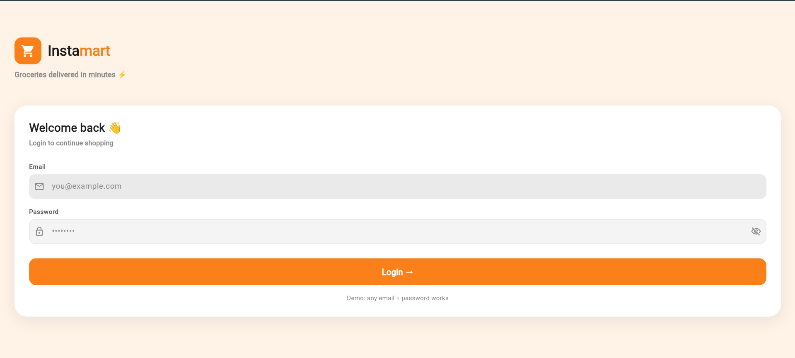
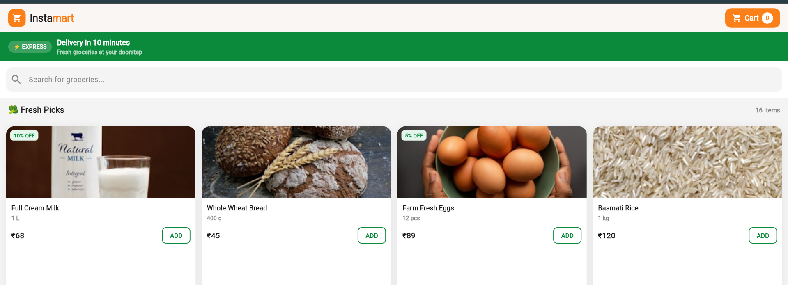
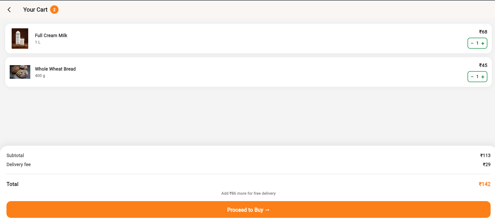
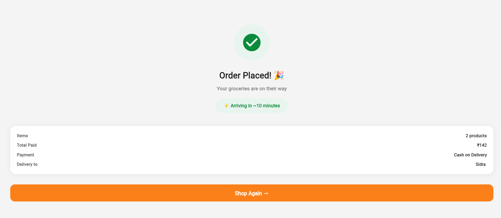

# 🛒 Instamart Clone :

👉 **[Click Here to View Project](https://sidra-instamart-flutter.netlify.app/)**

Instamart Clone is a responsive shopping web application built using **Flutter and Dart**. The project replicates the core functionality of an online grocery platform, allowing users to browse products, search items, and manage their cart seamlessly.

## 🚀 Features

* 🔐 **User Authentication**  
  Simple login interface for user access

* 🛍️ **Product Listing**  
  Displays products with name, image, and price
  

* 🔎 **Search Functionality**  
  Quickly find products using a dynamic search bar

* 🛒 **Add to Cart**  
  Add or remove items from the shopping cart

* 💰 **Cart Total Calculation**  
  Real-time calculation of total price based on selected items
  

* ✅ **Order Confirmation**  
  Basic checkout flow with confirmation message
  

## 🧰 Tech Stack

* Flutter  
* Dart  

## 🎯 Purpose

This project was built to strengthen Flutter development skills and understand the core logic behind e-commerce applications such as product handling, cart management, and user interaction.

## 👩‍💻 Author

**Sidra Shaikh**
